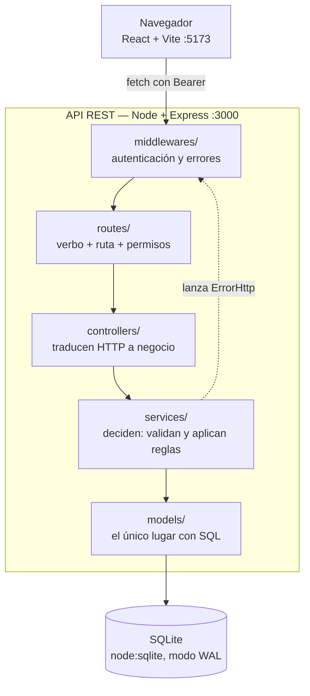
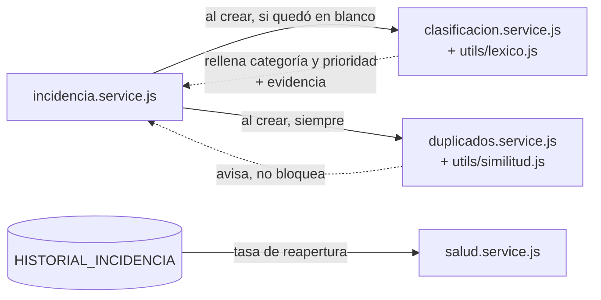

# Arquitectura en tres capas

Figura del recorrido de una petición. Cada flecha cruza una frontera, y las
fronteras son el aporte de la arquitectura: lo que importa no es que existan las
carpetas, sino lo que cada una **no** puede hacer.

## Lo que cada capa tiene prohibido

| Capa | Su trabajo | Lo que no puede hacer |
|---|---|---|
| `routes/` | Decir qué existe y quién puede usarlo | Nada de lógica |
| `controllers/` | Leer `req`, llamar al service, responder | Tocar la base de datos; usar `try/catch` |
| `services/` | Validar, decidir, lanzar `ErrorHttp` | Conocer Express: no reciben `req` ni `res` |
| `models/` | Ejecutar SQL | Validar o elegir códigos HTTP |

La flecha punteada es la que explica por qué los controladores no llevan
`try/catch`: un service lanza un `ErrorHttp` que ya trae su `status` adentro,
Express lo captura solo y lo entrega a `middlewares/errorHandler.js`, que arma la
respuesta. Añadir `try/catch` en cada controlador solo repetiría ruido.

Que los services no reciban `req` ni `res` es lo que permite probarlos sin
levantar un servidor: las 29 pruebas funcionales llaman directamente a
`crearIncidencia()` y `cambiarEstado()`.

## Dónde se conectan los tres diferenciadores

Los tres comparten un criterio y la figura lo refleja: las flechas de vuelta son
punteadas porque **ninguno decide**. La clasificación rellena solo lo que quedó en
blanco y adjunta los términos que la motivaron; el detector avisa sin impedir el
registro; el índice se calcula leyendo la bitácora y entrega su desglose por
componente, o `SIN_DATOS` en vez de fingir salud.

El índice no nace de la creación de una incidencia, y por eso cuelga del
historial y no del service: se calcula cuando se consulta, a partir de los
cambios de estado que ya quedaron registrados.

## Mantenimiento

Las reglas que estas figuras resumen están escritas con más detalle en
[`../../CLAUDE.md`](../../CLAUDE.md), que es el documento que las hace cumplir al
escribir código nuevo.
