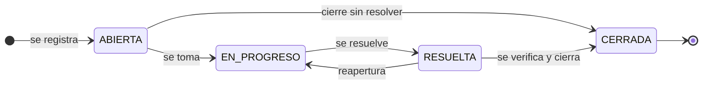

# Máquina de estados de una incidencia

Figura del flujo de trabajo. Es la traducción del dato `TRANSICIONES` de
`backend/src/services/incidencia.service.js`, que es donde la máquina vive de
verdad.

## Las cinco transiciones, en detalle

| Desde | Hacia | Significado | Motivo | `fecha_resolucion` |
|---|---|---|---|---|
| — | `ABIERTA` | Se registra la incidencia | — | nula |
| `ABIERTA` | `EN_PROGRESO` | Alguien la toma y empieza a trabajar | opcional | sin cambio |
| `ABIERTA` | `CERRADA` | Cierre sin trabajo: duplicada, no se reproduce, no aplica | **obligatorio** | queda nula |
| `EN_PROGRESO` | `RESUELTA` | Hay una solución propuesta | opcional | **se asigna** |
| `RESUELTA` | `EN_PROGRESO` | Reapertura: la solución no resultó | opcional | **se borra** |
| `RESUELTA` | `CERRADA` | Verificada y cerrada | opcional | se conserva |

## Las cuatro decisiones que encierra la figura

**`CERRADA` es un estado final.** No tiene salidas. Si el proyecto necesitara
reabrir incidencias cerradas, basta agregar `'EN_PROGRESO'` a su lista en
`TRANSICIONES` y el resto del sistema se adapta solo: los botones de la interfaz
se dibujan desde `transiciones_posibles`, que el backend calcula.

**El atajo `ABIERTA → CERRADA` existe por el detector de duplicados.** Cuando una
incidencia se marca como repetida, obligarla a recorrer `EN_PROGRESO` y
`RESUELTA` registraría un trabajo que nunca ocurrió y ensuciaría las métricas de
tiempo de resolución. Como en ese camino no hay resolución real,
`fecha_resolucion` queda nula.

**Ese atajo es el único que exige comentario.** Cerrar algo sin haberlo trabajado
siempre tiene un motivo, y ese motivo es la única explicación que quedará en la
bitácora. Sin él, dentro de seis meses nadie podrá decir por qué esa incidencia
se cerró sin tocarla. La regla está en `TRANSICIONES_QUE_EXIGEN_MOTIVO`.

**La reapertura borra la fecha de resolución, pero el cierre la conserva.** Son
dos reglas distintas y conviene no confundirlas: al reabrir, la fecha anterior
dejó de ser cierta; al cerrar desde `RESUELTA`, el dato queda definitivo para las
métricas. Además, una reapertura es exactamente un registro del historial con
`estado_anterior = 'RESUELTA'` y `estado_nuevo = 'EN_PROGRESO'`, y es así como el
índice de salud mide la tasa de reapertura.

## Cómo se hace cumplir

El orden de los estados es una regla de negocio, no una restricción de datos: SQL
puede limitar **qué** valores admite la columna (lo hace un `CHECK`), pero no en
**qué orden** pueden ocurrir, porque para eso hay que conocer el estado anterior.

Por eso la única vía para cambiar el estado es
`POST /api/incidencias/:id/transicion`, nunca un `PUT` del campo: la operación
valida la transición, ajusta la fecha de resolución y escribe la bitácora, las
tres cosas dentro de una transacción. Un `PUT` del campo se saltaría el historial
y la tasa de reapertura quedaría mintiendo.

Las transiciones ilegales responden **409 Conflict**, no 400: la petición está
bien formada y la misma operación podría ser válida más adelante; lo que falla es
que no corresponde en el estado actual.

Las diez pruebas del grupo «Maquina de estados» en
`backend/tests/funcionales.test.js` recorren este diagrama completo: el flujo
legal, los saltos prohibidos, el estado final, el motivo obligatorio y los cuatro
comportamientos de `fecha_resolucion`.
