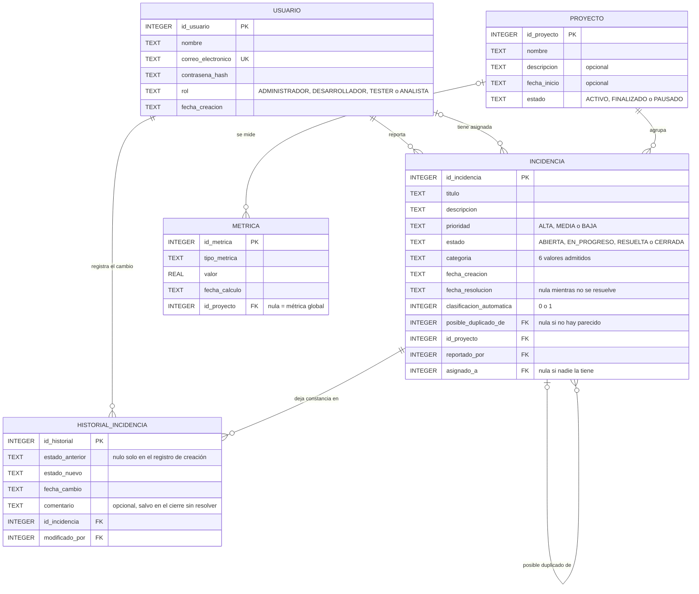

# Diagrama entidad-relación

Figura del modelo de datos. Las cinco entidades, sus atributos y las relaciones
entre ellas, tal como están declaradas en `backend/src/db/schema.sql`.

## Lo que el diagrama no puede mostrar

Las cardinalidades dicen cuántos registros se relacionan, pero no qué ocurre al
borrar uno. Esa decisión está en cada clave foránea y es la que protege la
trazabilidad:

| Relación | Al borrar el padre | Por qué |
|---|---|---|
| `INCIDENCIA.id_proyecto` | `RESTRICT` | Un proyecto con incidencias no se borra: se perdería el trabajo registrado |
| `INCIDENCIA.reportado_por` | `RESTRICT` | Quien reportó es un dato histórico; borrarlo dejaría incidencias sin autor |
| `INCIDENCIA.asignado_a` | `SET NULL` | Que alguien deje el equipo no destruye la incidencia: queda sin asignar |
| `INCIDENCIA.posible_duplicado_de` | `SET NULL` | Si la original desaparece, el aviso deja de tener sentido, pero el duplicado sigue siendo una incidencia válida |
| `HISTORIAL_INCIDENCIA.id_incidencia` | `CASCADE` | La bitácora no tiene vida propia: sin su incidencia no significa nada |
| `HISTORIAL_INCIDENCIA.modificado_por` | `RESTRICT` | Un cambio sin responsable rompe la trazabilidad, que es la base del índice de salud |
| `METRICA.id_proyecto` | `CASCADE` | Una métrica es un valor calculado; se recalcula, no se conserva |

Dos restricciones más que tampoco se ven en la figura:

- `correo_electronico` es `UNIQUE`: impide dos cuentas con el mismo correo.
- `posible_duplicado_de <> id_incidencia`: una incidencia no puede ser duplicada
  de sí misma. Es un `CHECK`, porque el error es imposible de cometer a mano pero
  trivial de cometer con un bucle.

## Mantenimiento

Esta figura **repite** lo que declara `schema.sql`. Si se agrega una columna o se
cambia una clave foránea, hay que editar los dos lugares: el esquema es la verdad
y el diagrama es la explicación. El diccionario de datos completo, con tipos y
justificaciones, está en [`../modelo-datos.md`](../modelo-datos.md).
